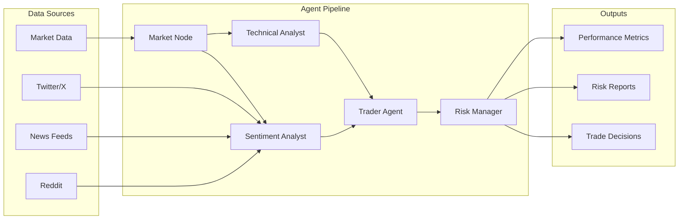

# TradingAgents 🤖📈

[](https://github.com/your-org/TradingAgents/actions/workflows/ci.yml)
[](https://www.python.org/downloads/)
[](https://opensource.org/licenses/MIT)

An **LLM-driven, multi-agent trading system** that ingests crypto market data, analyzes sentiment, performs technical analysis, and executes risk-managed trades. Think of it as a sophisticated trading bot powered by artificial intelligence.

## ✨ Features

- 🧠 **Multi-Agent Architecture**: Specialized agents for sentiment analysis, technical analysis, trading decisions, and risk management
- 📊 **Real-time Data Processing**: Live price feeds, Twitter sentiment, news analysis, and technical indicators
- 🔒 **Risk Management**: Built-in position sizing, drawdown limits, and trade approval workflows
- 📈 **Backtesting & Analytics**: Historical replay with performance metrics and sentiment correlation analysis
- 🎯 **Multiple LLM Support**: OpenAI, Anthropic, Google Gemini, and local models via Ollama
- 🖥️ **Live Dashboard**: Real-time monitoring with charts, metrics, and trade visualization
- 🐳 **Docker Support**: Containerized deployment with monitoring stack (Prometheus + Grafana)

## 🚀 Quick Start

### Prerequisites

- **Python 3.11+** (Python 3.12 recommended)
- **Poetry** (recommended) or **pip**
- **Git**

### 1. Clone and Install

#### For macOS Users

**Option 1: Automated Setup (Recommended)**
```bash
# Clone the repository
git clone https://github.com/your-org/TradingAgents.git
cd TradingAgents

# Run the automated setup script
chmod +x setup-macos.sh
./setup-macos.sh
```

**Option 2: Manual Setup**
```bash
# Install prerequisites (if not already installed)
xcode-select --install

# Install Homebrew (if not already installed)
/bin/bash -c "$(curl -fsSL https://raw.githubusercontent.com/Homebrew/install/HEAD/install.sh)"

# Install Python and Poetry
brew install python@3.12 poetry

# Clone the repository
git clone https://github.com/your-org/TradingAgents.git
cd TradingAgents

# Install with Poetry (recommended)
poetry install
poetry shell
```

#### For Windows/Linux Users

```bash
# Clone the repository
git clone https://github.com/your-org/TradingAgents.git
cd TradingAgents

# Install with Poetry (recommended)
poetry install
poetry shell

# Or install with pip
python -m venv venv
source venv/bin/activate  # On Windows: venv\Scripts\activate
pip install -r requirements.txt
```

### 2. Configure Environment Variables

```bash
# Copy the example environment file
cp .env.example .env

# Edit .env with your API keys (see Configuration section below)
# At minimum, you need:
# OPENAI_API_KEY=sk-your-openai-api-key-here
# TWIKIT_USERNAME=your-twitter-username
# TWIKIT_PASSWORD=your-twitter-password
```

### 3. Run Your First Demo

```bash
# Basic demo with mock data
poetry run python -m tradingagents run-demo --symbol BTCUSD

# With live price feeds (falls back to mock after 30s)
poetry run python -m tradingagents run-demo --symbol BTCUSD --live
```

### 4. Start the Dashboard

```bash
# Start the live monitoring dashboard
poetry run python -m tradingagents dashboard

# Open http://localhost:8000 in your browser
```

## ⚙️ Configuration

### Required API Keys

Create a `.env` file in the project root with your API keys:

```bash
# =============================================================================
# REQUIRED: LLM Provider (choose one)
# =============================================================================

# OpenAI (recommended for beginners)
OPENAI_API_KEY=sk-your-openai-api-key-here
LLM_PROVIDER=openai
LLM_DEEP_THINK_MODEL=gpt-4o-mini
LLM_QUICK_THINK_MODEL=gpt-4o-mini

# =============================================================================
# REQUIRED: Social Media Data
# =============================================================================

# Twitter/X credentials (for sentiment analysis)
TWIKIT_USERNAME=your-twitter-username
TWIKIT_PASSWORD=your-twitter-password

# =============================================================================
# OPTIONAL: Additional Data Sources
# =============================================================================

# Financial data (free tier available)
FINNHUB_API_KEY=your-finnhub-api-key-here

# Alternative LLM providers
ANTHROPIC_API_KEY=your-anthropic-api-key-here
GOOGLE_API_KEY=your-google-api-key-here

# Database (for production deployments)
REDIS_URL=redis://localhost:6379/0
POSTGRES_HOST=localhost
POSTGRES_DB=trading
POSTGRES_USER=trader
POSTGRES_PASSWORD=your-postgres-password
```

### Getting API Keys

| Service | Purpose | How to Get | Cost |
|---------|---------|------------|------|
| [OpenAI](https://platform.openai.com/api-keys) | LLM inference | Create account → API Keys | Pay-per-use |
| [Twitter/X](https://twitter.com) | Sentiment data | Use existing account | Free |
| [FinnHub](https://finnhub.io/register) | Financial data | Register for free | Free tier |
| [Anthropic](https://console.anthropic.com/) | Claude models | Create account → API Keys | Pay-per-use |
| [Google AI](https://aistudio.google.com/app/apikey) | Gemini models | Create account → API Keys | Free tier |

## 🎯 Usage Examples

### Basic Trading Demo

```bash
# Run a simple trading demo
poetry run python -m tradingagents run-demo --symbol BTCUSD

# Example output:
# {"action":"long","size_pct":2}
# {"approved":true,"new_size_pct":2}
# {"breakout":true,"sma":43050.0,"ema":43123.7}
```

### Historical Backtesting

```bash
# Basic backtest with mock data
poetry run python -m tradingagents replay \
  --from 2024-01-01 --to 2024-01-02 \
  --symbol BTCUSD

# Advanced backtest with historical tweets and visualization
poetry run python -m tradingagents replay \
  --from 2024-01-01 --to 2024-01-02 \
  --symbol BTCUSD \
  --tweets sample_tweets.csv \
  --plot

# Example output:
# 📈 REPLAY RESULTS: BTCUSD
# ============================================================
# Period: 2024-01-01 00:00:00 to 2024-01-02 00:00:00
# Initial Equity: $10,000.00
# Final Equity:   $10,245.67
# Total Return:   2.46%
# Sharpe Ratio:   1.23
# Max Drawdown:   -1.2%
# Total Trades:   8
# Win Rate:       75.0%
# Sentiment Correlation: 0.156
# 🎯 SIGNIFICANT sentiment-price correlation detected!
```

### Python API Usage

```python
from tradingagents.graph.trading_graph import TradingAgentsGraph
from tradingagents.config import settings

# Initialize the trading system
ta = TradingAgentsGraph(debug=True, config=settings.model_dump())

# Execute a trading decision
state, decision = ta.propagate("BTCUSD", "2024-05-10")
print(f"Decision: {decision}")

# Custom configuration
config = settings.model_dump()
config["deep_think_llm"] = "gpt-4o"
config["max_debate_rounds"] = 3
config["online_tools"] = True

ta_custom = TradingAgentsGraph(debug=True, config=config)
```

## 🏗️ Architecture



### Agent Roles

- **Market Node**: Streams live price data and maintains price history
- **Sentiment Analyst**: Analyzes Twitter/news sentiment using embeddings or heuristics
- **Technical Analyst**: Computes SMA/EMA crossovers, breakouts, and technical indicators
- **Trader Agent**: Makes buy/sell decisions based on sentiment and technical signals
- **Risk Manager**: Validates trades, enforces position limits, and manages portfolio risk

### Sentiment Analysis

The system supports multiple sentiment analysis methods:

| Method | When Used | How It Works |
|--------|-----------|--------------|
| **OpenAI Embeddings** | `OPENAI_API_KEY` present | Embeds tweet text, compares to bullish/bearish exemplars using cosine similarity |
| **Heuristic Fallback** | No API key or embedding fails | Keyword + emoji analysis (`🚀`, `moon`, `rekt`, etc.) with weighted scoring |

## 📊 Dashboard & Monitoring

### Live Dashboard

Start the dashboard to monitor your trading system in real-time:

```bash
poetry run python -m tradingagents dashboard
```

Features:
- 📈 **Real-time price charts** with technical indicators
- 💭 **Sentiment analysis** with live Twitter feed processing
- 🎯 **Trade decisions** and risk management approvals
- 📊 **Performance metrics** and equity curve
- 🔄 **Auto-refresh** every 2 seconds

### Monitoring Stack (Docker)

For production deployments, use the full monitoring stack:

```bash
# Start TradingAgents + Prometheus + Grafana
docker compose up -d

# Access dashboards:
# - Grafana: http://localhost:3000 (admin/changeme)
# - Prometheus: http://localhost:9090
# - TradingAgents: http://localhost:8001
```

## 🔧 Advanced Configuration

### LLM Providers

Switch between different LLM providers by updating your `.env`:

```bash
# OpenAI (default)
LLM_PROVIDER=openai
LLM_BACKEND_URL=https://api.openai.com/v1

# Anthropic Claude
LLM_PROVIDER=anthropic
LLM_BACKEND_URL=https://api.anthropic.com/
ANTHROPIC_API_KEY=your-key-here

# Google Gemini
LLM_PROVIDER=google
LLM_BACKEND_URL=https://generativelanguage.googleapis.com/v1
GOOGLE_API_KEY=your-key-here

# Local Ollama
LLM_PROVIDER=ollama
LLM_BACKEND_URL=http://localhost:11434/v1
```

### Trading Parameters

Customize trading behavior in your `.env`:

```bash
# Risk management
MAX_DEBATE_ROUNDS=3
MAX_RISK_DISCUSS_ROUNDS=2
LIVE_TIMEOUT=60

# Features
ONLINE_TOOLS=true  # Use live data vs cached
LOG_LEVEL=INFO
```

## 🧪 Testing

```bash
# Run the full test suite
poetry run pytest tests/ -v

# Run specific test categories
poetry run pytest tests/test_agents.py -v
poetry run pytest tests/test_sentiment.py -v

# Run with coverage
poetry run pytest tests/ --cov=tradingagents --cov-report=html
```

### macOS-Specific Testing

```bash
# Test Python version
python3 --version  # Should show 3.11+ 

# Test Poetry installation
poetry --version

# Test virtual environment
poetry shell
python -c "import sys; print(f'Python: {sys.version}')"

# Test TradingAgents import
python -c "from tradingagents.config import settings; print('✅ Import successful')"

# Test dependencies
python -c "import openai, pandas, numpy; print('✅ Core dependencies OK')"
```

## 🐳 Docker Deployment

### Development

```bash
# Start the application
docker compose up -d

# View logs
docker compose logs -f app

# Stop services
docker compose down
```

### Production

```bash
# Build and deploy with monitoring
docker compose -f docker-compose.yml -f docker-compose.prod.yml up -d

# Scale the application
docker compose up -d --scale app=3
```

## 📚 Documentation

- **[Installation Guide](DEPENDENCIES.md)**: Detailed setup instructions for all platforms
- **[macOS Setup Guide](MACOS_SETUP.md)**: Comprehensive macOS-specific instructions
- **[API Reference](docs/api.md)**: Complete API documentation
- **[Agent Architecture](docs/agents.md)**: Deep dive into agent design
- **[Monitoring Setup](GRAFANA_SETUP.md)**: Grafana dashboard configuration

## 🤝 Contributing

We welcome contributions! Please see our [Contributing Guide](CONTRIBUTING.md) for details.

1. Fork the repository
2. Create a feature branch (`git checkout -b feature/amazing-feature`)
3. Commit your changes (`git commit -m 'Add amazing feature'`)
4. Push to the branch (`git push origin feature/amazing-feature`)
5. Open a Pull Request

## 📝 License

This project is licensed under the MIT License - see the [LICENSE](LICENSE) file for details.

## 🆘 Support

### macOS-Specific Troubleshooting

**Issue: `command not found: python`**
```bash
# Solution: Use python3 or create alias
echo 'alias python=python3' >> ~/.zshrc
echo 'alias pip=pip3' >> ~/.zshrc
source ~/.zshrc
```

**Issue: Poetry not found after installation**
```bash
# Add Poetry to PATH
export PATH="$HOME/.local/bin:$PATH"
echo 'export PATH="$HOME/.local/bin:$PATH"' >> ~/.zshrc
source ~/.zshrc
```

**Issue: ChromaDB installation fails on Apple Silicon**
```bash
# Set architecture flags
export ARCHFLAGS="-arch arm64"
pip install chromadb
```

**Issue: SSL certificate verification failed**
```bash
# Update certificates
brew install ca-certificates
# or run the certificate update command
/Applications/Python\ 3.12/Install\ Certificates.command
```

### General Support

- **Documentation**: Check our [docs](docs/) directory
- **Issues**: [GitHub Issues](https://github.com/your-org/TradingAgents/issues)
- **Discussions**: [GitHub Discussions](https://github.com/your-org/TradingAgents/discussions)
- **Discord**: Join our community server

## ⚠️ Disclaimer

This software is for educational and research purposes only. Do not use it for actual trading without proper risk management and understanding of the markets. The authors are not responsible for any financial losses incurred through the use of this software.

## 🙏 Acknowledgments

- Built with [LangChain](https://langchain.com/) and [LangGraph](https://langchain-ai.github.io/langgraph/)
- Inspired by modern quantitative trading systems
- Thanks to all contributors and the open-source community

---

**Happy Trading!** 🚀
