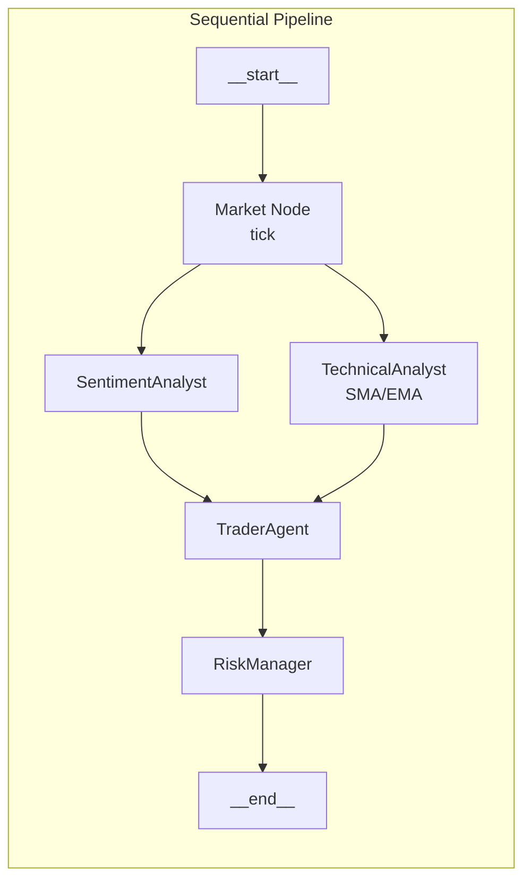

# TradingAgents 🤖📈
[](https://github.com/<org>/<repo>/actions/workflows/ci.yml)

An LLM‑driven, multi‑agent prototype that ingests crypto‑market data, reasons about opportunities, and spits out risk‑checked trades—like a baby hedge fund on your laptop.

## Quick‑start

```bash
git clone https://github.com/<org>/<repo>.git
cd <repo>
poetry install  # Python 3.11+
poetry run python -m tradingagents run-demo --symbol BTCUSD
```

### Live mode

Run with `--live` to connect to a real WebSocket feed.

```bash
poetry run python -m tradingagents run-demo --symbol BTCUSD --live
```

*Current status*: falls back to a high‑fidelity mock after 30 s while we finish Hyperliquid integration.

Example output

```json
{"action":"long","size_pct":2}
{"approved":true,"new_size_pct":2}
{"breakout":true,"sma":43050.0,"ema":43123.7}
```

## How it works

Market Node – (currently mocked) streams prices into a 20‑tick deque.

TechnicalAnalyst – computes SMA/EMA crossover and sets breakout.

SentimentAnalyst – scores tweets/news using embeddings or keyword heuristics.

TraderAgent – goes long if breakout && sentiment>60.

RiskManager – caps size at 2 % and vetoes oversize trades.

### Sentiment scoring

`SentimentAnalyst` now supports two paths:

| Path | When used | How it works |
|------|-----------|--------------|
| **OpenAI embeddings** | `OPENAI_API_KEY` present in the environment | The tweet text is embedded via `openai.embeddings.create`, compared (cos θ) to bullish/bearish exemplar vectors, and mapped to a 0‑100 score. |
| **Heuristic fallback** | No API key or embedding request fails | Keyword + emoji lookup (`🚀`, `moon`, `rekt`, etc.) with weighted counts produces a quick score. |

> **Tip:** try  
> ```bash
> poetry run python - <<'PY'
> from tradingagents.agents.analysts.sentiment_analyst import SentimentAnalyst
> import asyncio, os
>
> async def main():
>     agent = SentimentAnalyst()
>     state = {"tweets": [{"text": "🚀 $BTC to the moon!"}]}
>     result = await agent.run(state)
>     print(result)
>
> asyncio.run(main())
> PY
> ```  
> and watch the score jump above 60.

## Roadmap
Swap in live Hyperliquid WebSocket feed.

Replace hard‑coded sentiment with an embedding classifier.

Add paper‑trading account and PnL dashboard.

© 2025 Your Name. MIT License.

# (fill in <org>/<repo> once merged)
